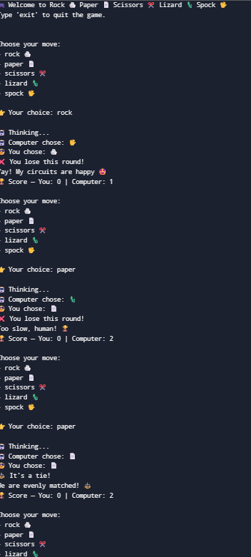

# Rck Paper Scissors
What I Learned
Using dictionaries and lists to store game data (moves, emojis, rules).

Applying conditional logic to decide the winner.

 What I Enjoyed the Most
Designing the computer’s personality with random, funny responses.

Adding emojis to make the game more visual in the terminal.
 Future Improvements

Include sound effects for win/lose/tie events.

